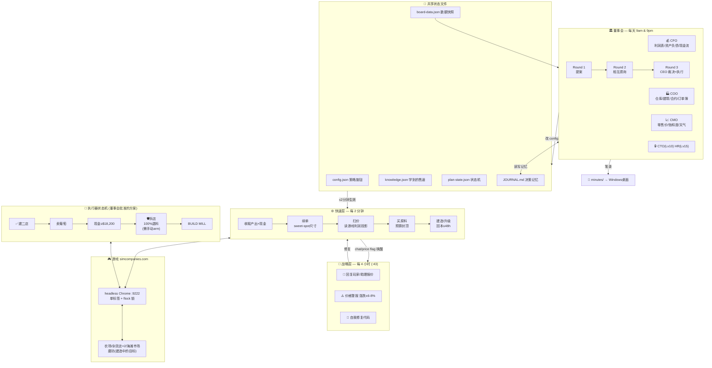

# Sim Companies 自动化架构（文字精确版）

## 关键机制
- **决策→执行链**：董事会改 config.json → 快速层下一个 tick(≤2分钟)自动按新策略跑
- **记忆链**：JOURNAL.md 让董事会跨会议不失忆；market-snapshots 让 CMO 察觉玩家涌入
- **安全阀**：拆除不可逆 → 两阶段（先只读记录对话框 → scrapArmed:true 才真拆）→ API验证
- **锁**：所有浏览器操作抢同一把 .tick.lock，永不并发冲突
